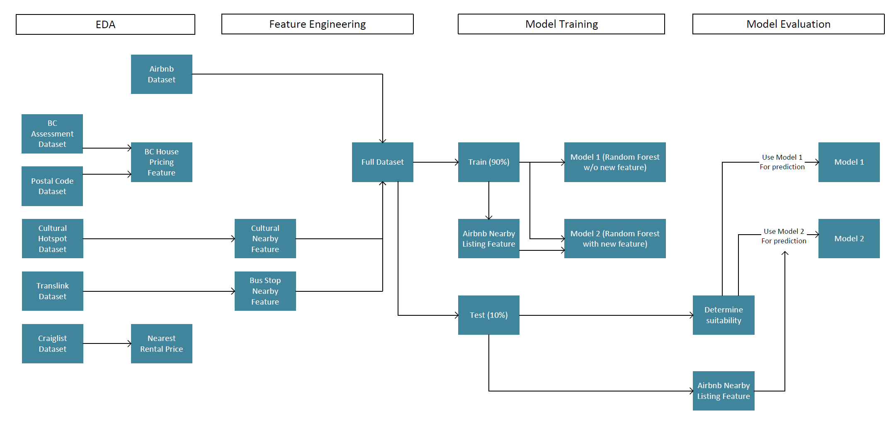
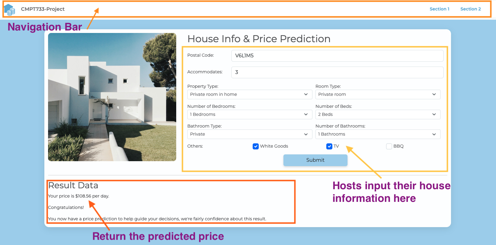

# A Data-Driven Analysis of Vancouver's Rental and Airbnb Properties 
> Utilizing BC Assessment, Vancouver Cultural Spaces, and Translink Datasets

**Members: Guanghua Yang, Jianan Li, Kewei Li, Ningyi Ke, Wenbin Li**

## Introduction
The sharing economy has experienced significant growth in recent years, with platforms like Airbnb revolutionizing the way people travel and seek accommodations. Understanding the factors that drive pricing and review ratings in the Airbnb market is essential for both hosts and guests, as well as policymakers and researchers interested in the impact of short-term rentals on housing markets, local economies, and cultural landscapes.
## Dataset
|  Dataset   | Link  |
|  ----  | ----  |
| Vancouver Airbnb Dataset  | http://insideairbnb.com/get-the-data/ |
| BC Assessment  | https://opendata.vancouver.ca/explore/dataset/property-tax-report/information/ |
| Postal Code Conversion File  | https://abacus.library.ubc.ca/dataset.xhtml?persistentId=hdl:11272.1/AB2/KBP0AM |
| Vancouver Cultural Spaces  | https://opendata.vancouver.ca/explore/dataset/cultural-spaces/export/?disjunctive.type&disjunctive.primary_use&disjunctive.ownership |
| GTFS Static Data (Translink)  | https://www.translink.ca/about-us/doing-business-with-translink/app-developer-resources/gtfs/gtfs-data |
| Craigslist Rental Data | 7,700 rows crawled  |

## Data Science Pipline

## Data Product

## Demo

